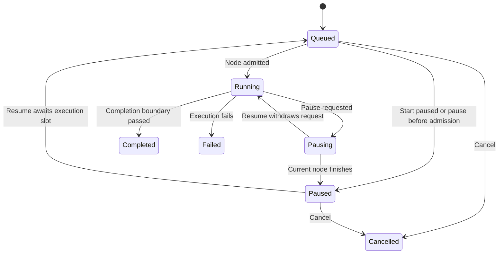
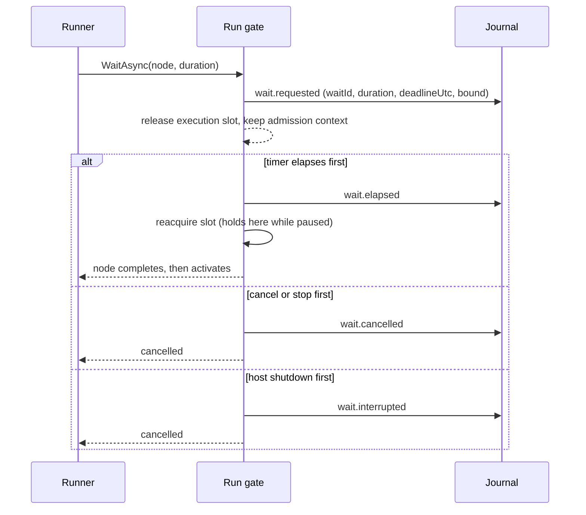

# Pause and resume

The development runtime supports cooperative, process-owned pause/resume for linear workflows. Execution stays on the backend when the editor closes. A paused run remains paused until explicitly resumed or cancelled, or its host stops. This is not a durable checkpoint across restarts.

## Boundary behavior

**Pause selected run** requests a pause. An admitted node finishes first, including its model rounds and tool calls. The runtime records `run.paused` before admitting the next node; it also checks a boundary before final run completion. A request does not cancel, undo, or interrupt an external operation. The graph highlights the next node when one is known. At the final completion boundary there is no next node to highlight.

```mermaid
stateDiagram-v2
    [*] --> Queued
    Queued --> Running: Node admitted
    Queued --> Paused: Start paused or pause before admission
    Running --> Pausing: Pause requested
    Pausing --> Paused: Current node finishes
    Pausing --> Running: Resume withdraws request
    Paused --> Queued: Resume awaits execution slot
    Queued --> Cancelled: Cancel
    Paused --> Cancelled: Cancel
    Running --> Completed: Completion boundary passed
    Running --> Failed: Execution fails
```

The diagram shows common paths; cancellation and failure can also terminate a pending pause. Restart marks any unfinished run interrupted. The snapshot status after resume is `queued` if execution has not started, otherwise `running`, including while awaiting the shared execution slot.

Resume continues the same live Agent Framework execution with the same run ID, immutable revision, and invocation history. Completed nodes are not rerun. It does not load a new definition or rebuild execution from recorded events. Use **Start paused** for quick runs or **Start published run paused** for published runs to avoid racing a fast deterministic workflow.

The runtime admits at most 32 owned contexts, including queued, running and paused contexts. One shared execution permit serializes active workflow work. Paused continuations release that permit, so another admitted run can execute; they still consume admission capacity. A full or stopping runtime records a failed run. Cancellation unblocks paused waits. Fair scheduling is not guaranteed.

## APIs and embedding

The additive Core interfaces `IWorkflowRunControl` and `IPublishedWorkflowRunControl` expose paused starts and pause/resume commands. Existing clients can keep implementing only `IWorkflowClient`; components show controls only when the corresponding capability is available. Component disposal stops observation, not execution or its pause state. Low-level hosts may supply `IWorkflowExecutionGate` to `WorkflowRunner.ExecuteControlledAsync`; they own synchronization, cancellation and persistence policy.

| Request | Behavior |
| --- | --- |
| `POST /api/runs` with `{ "definition": { ... }, "input": "text", "startPaused": true }` | Create an ad-hoc run paused before its first node |
| `POST /api/workflows/{id}/runs` with `{ "input": "text", "startPaused": true }` | Pin the active publication and start paused |
| `POST /api/revisions/{id}/runs` with the same body | Pin that exact publication and start paused |
| `POST /api/runs/{id}/pause` | Request a cooperative pause; return 202 and the current snapshot |
| `POST /api/runs/{id}/resume` | Resume or withdraw a pending pause; return 202 and the current snapshot |

Repeated commands are idempotent while execution is owned and nonterminal. An unknown run returns 404; a terminal or no-longer-owned run returns 409. Development origin restrictions still apply (403 for disallowed origins). HTTP 202 does not promise the current node has finished; observe the snapshot for `paused`.

## Breakpoints and node stepping

The live run inspector can set or clear a breakpoint on an executable node, pause at that node's admission boundary, continue, and step one node at a time. Pure data nodes are evaluated as dependencies of an admitted executor and do not have separate breakpoint controls. A breakpoint is process-owned control state and does not change a workflow definition or revision. `debug.breakpoints.changed` records the current node-ID set so the inspector can restore the controls from run history; `debug.breakpoint.hit` records the node where admission stopped. These events are evidence of debugger controls, not node execution. They are stored in the same sequenced run history and historical playback never executes the graph.

`POST /api/runs/{id}/breakpoints` accepts `{ "nodeIds": ["node-id"] }`; an empty array clears all breakpoints. IDs must identify nodes with a runtime execution-admission boundary. `POST /api/runs/{id}/step` admits one node and pauses before the next node boundary. Both controls require the current host to own the live continuation. The stepping contract is limited to sequential graphs without loops, parallel regions, Sequence, Merge, Wait, nested workflow calls, or routed Agent outputs. A workflow with a **For Each** (including a Break, and the Condition or Boolean Branch that decides it) is supported; the button is disabled for the unsupported topologies. Continue remains available and keeps its cooperative behavior. A step completes the current node in full, including its model/tool work; it cannot interrupt or roll back in-flight operations. Host restart loses live control state, while recorded breakpoint events remain inspectable.

### Stepping through For Each and Break

The For Each node is an ordinary boundary: it is admitted at entry, once after every iteration, and finally to leave through `completed`. **Step node** at a For Each steps *into* the next iteration's first body node (or onto the node after `completed` when the array is exhausted); step over an iteration or the whole loop is not offered, so use Continue or a breakpoint after the loop. A breakpoint on a body node hits on every iteration (`debug.breakpoint.hit` carries the iteration `scopeId`, such as `each/2`). Continue or Step from a hit suppresses only that iteration's hit; the skip token is node id plus scope. After a Break, the next boundary is the `completed` continuation and the For Each is not admitted again. Pure data nodes still have no boundaries. Pause is acknowledged at the next boundary and cancel ends the run, as elsewhere. The runner reports scopes to gates that implement the optional `IWorkflowFrameExecutionGate`; gates implementing only `IWorkflowExecutionGate` keep working. Fork, Sequence, Loop and Wait inside or beside a For Each still disable stepping. See [Decision 0070](decisions/0070-bounded-array-iteration-contract.md#for-each-node-stepping-2026-11-25).

## Audit, playback and failure

`run.pause-requested`, `run.paused`, and `run.resumed` share one sequenced journal writer with executor/model/tool events. Control data records a boundary and the development actor `local-developer`; this is not authenticated actor identity. Node/model evidence arriving after a pause request does not reset the status to running. Playback derives state from the selected recorded prefix and never invokes execution. The latest status remains visible separately.

Checkpoint `suspended` state belongs to the separate [explicit recovery API](checkpoint-recovery.md); it is not an in-process pause and cannot be resumed through these controls. The runtime and controller use the host-selected [run store](run-storage.md), with expected-sequence event commits and consistent read-only snapshots. Graceful shutdown cancels live waits. Restart marks remaining unfinished journal entries interrupted; their old continuation cannot be resumed. Provider errors may fail a run before its requested pause is acknowledged. Durable checkpoints, recovery of uncertain external effects, distributed ownership and authenticated control authorization remain planned. The adapter uses awaited executor boundaries supported by the pinned Microsoft Agent Framework 1.26.0; it does not claim checkpoint restore support from that integration.

## Verification

`PauseResumeTests` exercises in-flight pause acknowledgement, withdrawal, repeated commands, node boundaries, cancellation, admission limits, independent work while paused, pinned identity and owner loss. It also proves one-node stepping and breakpoint pause/continue behavior. `ForEachSteppingTests` covers stepping through a For Each and a Break, per-iteration breakpoint hits with per-scope skip, and cancel during a step; `ForEachExecutionTests` covers the gate overloads. `ApiParityTests.DebuggerEndpointsConfigureBreakpointsAndStepARecordedRun` exercises the API. Adapter tests cover the final completion boundary. `python3 scripts/pause_resume_smoke.py --browser-executable /usr/bin/chromium` exercises pause, breakpoint, step and continue controls through the Studio, browser reload, exact published versions and recorded playback using deterministic local data.

## Waiting for approval

`waiting-approval` is a nonterminal status. Resume does not approve, and approval does not clear a manual pause. Approval waits release execution ownership while still consuming an admission context. Cancellation/shutdown unblocks them; restart interrupts unfinished runs rather than reviving unresolved decisions. See [exact-action approvals](approvals.md).

## Waiting on a Wait node

A `core.wait` node (schema 2.0) holds the run for a fixed duration. The host measures it on a monotonic clock (`TimeProvider.GetTimestamp`); the recorded UTC deadline is display-only. The wait is in-process and bounded. See [Decision 0081](decisions/0081-latent-and-time-based-work.md#wait-first-slice-implementation-2026-11-24) for every rule and what is deferred.

```mermaid
sequenceDiagram
    participant R as Runner
    participant G as Run gate
    participant J as Journal
    R->>G: WaitAsync(node, duration)
    G->>J: wait.requested (waitId, duration, deadlineUtc, bound)
    G-->>G: release execution slot, keep admission context
    alt timer elapses first
        G->>J: wait.elapsed
        G->>G: reacquire slot (holds here while paused)
        G-->>R: node completes, then activates
    else cancel or stop first
        G->>J: wait.cancelled
        G-->>R: cancelled
    else host shutdown first
        G->>J: wait.interrupted
        G-->>R: cancelled
    end
```

Exactly one of `wait.elapsed`, `wait.cancelled` and `wait.interrupted` follows `wait.requested`. If the timer completed before cancellation was observed, elapse wins and a later cancel ends the run at its next boundary. A user stop settles `wait.cancelled`; a clean host shutdown settles `wait.interrupted`. Process loss records nothing, and reconciliation reports the unsettled request as unresolved, non-resumable work.

- **Pause.** Pause is acknowledged immediately (`run.paused` at the Wait node), as for an approval wait. The clock keeps running. When the timer elapses the node records `wait.elapsed` and then holds at the reacquire boundary until **Resume**. Cancel settles `wait.cancelled`.
- **Admission.** A waiting run releases the execution slot and keeps its admission context. Runs whose definition contains a Wait are capped (default 4, at most 16) well below the 32-run limit; an over-cap start is recorded as a failed run.
- **Bounds.** Defaults: 1 hour per wait, 2 hours per run. A larger author duration is rejected at admission, not shortened.
- **In a loop.** A Wait may sit in a Loop or For Each body (not in a Fork branch or Sequence output, even inside a loop). Admission charges it its duration times a provable execution bound: the enclosing Loop iteration limits, or 64 for a For Each (the array length is not known at admission), multiplied for nested loops; an unprovable bound is rejected as `wait.budget`. Each iteration records its own `wait.requested` and one settlement with a distinct `waitId`, the event `ScopeId` of the iteration, and a `loopIteration` property. Top-level waits do not carry these. Pause, Cancel, and shutdown behave as for any wait. See [Decision 0081](decisions/0081-latent-and-time-based-work.md#wait-in-loop-bodies-implementation-2026-11-25).
- **Stepping and breakpoints.** Node stepping is unavailable for a workflow containing a Wait. A breakpoint before the node works and is not hit again when the wait ends.
- **Hosts.** A runner given a gate without `IWorkflowWaitGate` refuses a workflow containing a Wait before any event is recorded.

